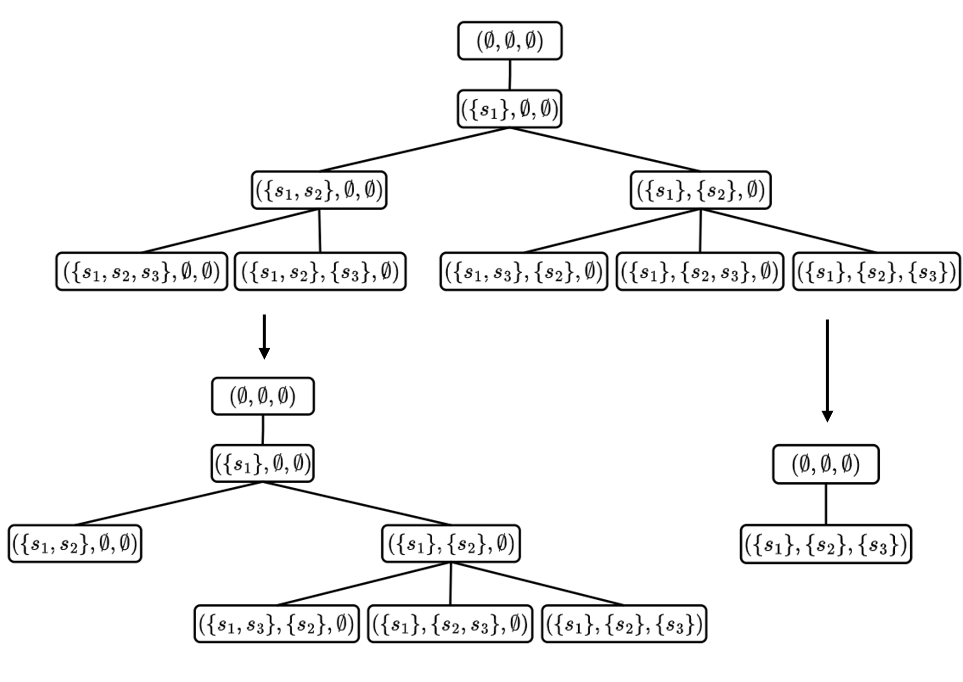

[](https://www.python.org/downloads/release/python-3100/)
[](https://opensource.org/licenses/Apache-2.0)

<p>
  
</p>

## $K$ -adaptability for two-stage stochastic optimization

Implementation of the PiM methdology proposed in 

[De Santis, M., Donnini, F. & Kurtz, J., K-adaptability for two-stage stochastic optimization. arXiv pre-print (2025)](https://arxiv.org/abs/??)

If you have used our code for research purposes, please cite the publication mentioned above.
For the sake of simplicity, we provide the Bibtex format:

```
@misc{desantis2025KPiM,
      title={$K$-adaptability for two-stage stochastic optimization}, 
      author={Marianna De Santis and Federica Donnini and Jannis Kurtz},
      year={2025},
      eprint={??},
      archivePrefix={arXiv},
      primaryClass={math.OC},
      url={https://arxiv.org/abs/??}, 
}
```

### Main Dependencies Installation

In order to execute the code, you need an [Anaconda](https://www.anaconda.com/) environment with Python>=3.10.

For the packages installation, open a terminal (Anaconda Prompt for Windows users) in the project root folder and execute the following commands.

```
pip install tabulate
pip install psutil
pip install gurobipy
pip install numpy
pip install sympy
pip install joblib
```

### Usage

In files starting with "pf" instance specific functions can be found.

Files ending with "_OR" refer to the original formulations of the corresponding problems, i.e. withouth the addition of a constraint requiring a minimum capacity be filled.

In ``` solver.py ``` implementations of PiM, CE and MIQP can be found.

In ``` environment.py ``` the data for each instance is defined.

Different values of $K$, $\ell$ or $n_x,n_y$ can be specified in the files starting with "main".

Given a terminal (Anaconda Prompt for Windows users), an example of execution could be the following.

``` python main_tskp.py ```

### Contact

If you have any question, feel free to contact:

[Federica Donnini](https://webgol.dinfo.unifi.it/federica-donnini/)<br>
Global Optimization Laboratory ([GOL](https://webgol.dinfo.unifi.it/))<br>
University of Florence<br>
Email: federica dot donnini at unifi dot it